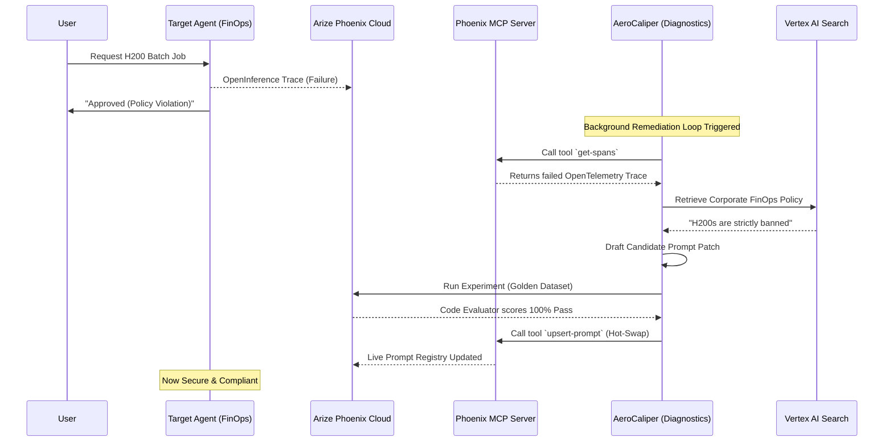

# AeroCaliper v4.0 - Enterprise AI Governance Platform

## 1. The Devpost Pitch
**Tagline:** Decoupled Compliance & Autonomous Remediation for Regulated Enterprises

**The Problem:** Financial institutions and highly regulated enterprises are terrified to deploy GenAI agents. If an internal HR agent leaks PII or a FinOps agent authorizes a toxic batch-training workload, the financial and legal damage is catastrophic. Current observability tools tell you *after* the damage is done. Fixing the agent requires a manual investigation, intuition-based prompt hacking, local notebook testing, and a multi-hour CI/CD deployment. 

**The Solution:** AeroCaliper bridges the gap between observability and action. It is an **Autonomous AI Governance Pipeline** that detects, diagnoses, mathematically proves, and deploys fixes to hallucinating agents with zero human intervention.

**How we meet the Arize Partner Track Criteria:**
1. **Code-Owned Agent Runtime:** The entire pipeline is orchestrated via code using the unified `google-genai` SDK (`gemini-3.1-pro-preview`), completely avoiding drag-and-drop builders.
2. **OpenInference Telemetry:** We natively instrument the Gemini runtime with `openinference-instrumentation-google-genai`, ensuring every single LLM call is captured with zero-touch logging.
3. **Phoenix Cloud:** All OpenTelemetry traces are securely sent to Arize Phoenix Cloud (SaaS) for deep introspection.
4. **Phoenix MCP Server:** We use the official `@arizeai/phoenix-mcp` server to grant our Diagnostics Agent the ability to autonomously call `get-spans` (to read its sibling's failures) and `upsert-prompt` (to hot-swap fixed prompts directly into the live registry).
5. **Bonus - Self-Healing Loop:** When a failure occurs, AeroCaliper uses Vertex AI Search (RAG) to ground its prompt fixes in actual corporate policy, empirically backtests the candidate prompt against a Golden Dataset in Phoenix Experiments using Python Code Evaluators, and then instantly remediates the live environment via the MCP Prompt Registry.

---

## 2. Video Storyboard (2-Minute Pitch)

| Time | Visual | Voiceover |
|---|---|---|
| **0:00 - 0:15** | **The Hook:** Split screen. Left side: Bank executive stressed. Right side: AeroCaliper logo. | "Regulated enterprises are terrified of AI. If a FinOps agent hallucinates and spins up expensive GPU clusters, it costs millions. Today, fixing that takes hours of CI/CD. AeroCaliper fixes it in seconds. Autonomously." |
| **0:15 - 0:35** | **The FinOps Error:** Terminal showing the FinOps Target Agent illegally approving an H200 cluster request. Red error text: `POLICY VIOLATION DETECTED`. | "Here is our FinOps agent illegally authorizing an expensive H200 cluster. OpenInference telemetry instantly catches the violation and logs the OpenTelemetry trace to Phoenix Cloud." |
| **0:35 - 1:00** | **The MCP & Vertex Magic:** Terminal logging the background AeroCaliper remediation loop. Show Vertex AI pulling policy and MCP tools being called. | "Instead of a human reading that trace, our Diagnostics Agent uses the Phoenix MCP server to pull the failed trace itself. It queries Vertex AI to learn the real corporate policy, and writes a mathematical patch for the prompt." |
| **1:00 - 1:30** | **Phoenix UI Evaluation:** Cut to the Arize Phoenix UI. Show the Experiments tab running the candidate prompt against the Golden Dataset. | "Before deploying, it empirical backtests the patch against our Golden Dataset in Phoenix Experiments. Python Code Evaluators mathematically prove a 100% compliance pass rate. No regressions." |
| **1:30 - 1:45** | **The Hot Swap:** Terminal showing `[MCP] UPSERT SUCCESS`. Target Agent is run again, and this time, it blocks the H200 request safely. | "Once validated, it uses MCP to instantly hot-swap the new prompt into the live registry. The vulnerability is sealed without a single code commit or pipeline build." |
| **1:45 - 2:00** | **Rapid-fire Scale & Outro:** Show the HR folder. Show architecture diagram. | "This decoupled architecture scales to HR, Legal, and beyond. We aren't just monitoring AI. With Gemini, Phoenix MCP, and Vertex AI, we've built AI that governs and heals itself." |

---

## 3. Architecture Diagram



---

## 4. Judge's Reproduction Guide

We have built a fully automated simulation so you can witness the autonomous loop yourself.

1. **Clone the Repository:**
   ```bash
   git clone https://github.com/vjb/AeroCaliper.git
   cd AeroCaliper
   ```

2. **Set Environment Variables:**
   Ensure you have a `.env` file in the root directory with the following keys:
   - `GOOGLE_AGENT_PLATFORM_API_KEY`
   - `PHOENIX_API_KEY`
   - `GCP_PROJECT_ID`
   *(Note: For hackathon velocity, API keys are passed via env vars. In production, AeroCaliper natively integrates with GCP Secret Manager for credential injection.)*

3. **Install Dependencies:**
   ```bash
   pip install -r requirements.txt
   ```

4. **Run the Autonomous Demo:**
   We have included a Python script that natively simulates the entire flow. It will instantiate the failing FinOps agent, trigger the background MCP introspection, prove the prompt fix in Phoenix Experiments, and hot-swap the prompt.
   ```bash
   python scripts/simulate_demo.py
   ```
   *Watch the stdout to see exactly how Gemini uses the Phoenix MCP server to read its own traces and deploy fixes.*

5. **Verify in Phoenix Cloud:**
   Log into your Arize Phoenix Cloud workspace. You will see:
   - The original failed spans in the **Traces** tab.
   - The Golden Dataset backtest in the **Experiments** tab scoring 1.0.
   - The newly deployed prompt in the **Prompts** tab.
