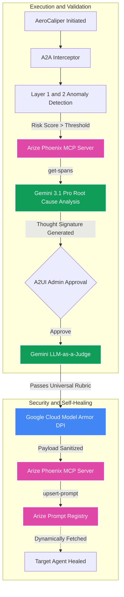

# AeroCaliper v4.0: The Universal AI Governance Firewall
**Google Agent Platform · Arize Phoenix MCP · Google Cloud Model Armor · Vertex AI Search RAG**

AeroCaliper is a zero-trust, closed-loop remediation platform that dynamically patches agentic hallucinations across multiple enterprise departments—all without human SOC intervention.

**Google Cloud Rapid Agent Hackathon Tracks:** Google Agent Platform · AI Observability & Monitoring · Enterprise Security & Compliance

[Watch the E2E Demo Video](AeroCaliper_E2E_Demo_Report.md) · [Architecture](ARCHITECTURE_AND_LIMITATIONS.md) · [Google & Arize Integration](docs/google_and_arize_integration.md)

---

## Stop Letting Agents Hallucinate Policy Violations.

As enterprises scale agentic workflows, the cost of AI hallucinations (data leakage, resource waste, policy violations) is skyrocketing. Manual SOC intervention is too slow.

AeroCaliper is the security layer between your enterprise constraints and your AI agents. By decoupling compliance from code using **Vertex AI Search**, AeroCaliper dynamically adapts to *any* department. Whether enforcing **Cloud FinOps budgets** or blocking **HR Privacy/PII leakage**, AeroCaliper detects failures via **Arize Phoenix**, grounds its diagnostics in departmental policy buckets, empirically backtests structural prompt patches against golden datasets, and deploys fixes autonomously.

### How it works:
1. **Dynamic RAG Governance:** Context-switches between domains (e.g., FinOps vs HR Privacy). When triggered, it queries **Vertex AI Search** to pull the relevant live policy (e.g., from `gs://aerocaliper-rag-bucket`).
2. **Arize Phoenix MCP:** Uses the official `@arizeai/phoenix-mcp` to fetch failed execution traces directly from the Phoenix Cloud workspace over JSON-RPC.
3. **LLM-as-a-Judge Backtesting:** **Gemini 3.1 Pro** deduces the root cause, generates a candidate patch (Thought Signature), and runs a comprehensive backtest against a golden dataset (`golden_dataset.csv`), scoring the pass rate.
4. **Model Armor Egress:** Before hitting production, the patched prompt undergoes Deep Packet Inspection (DPI) via **Google Cloud Model Armor** to prevent prompt injections.
5. **Zero-Trust Fail-Closed:** No mocks. No regex fallbacks. If Vertex AI Search takes 30 minutes to index a new Datastore, the system throws a strict `RuntimeError`. If the MCP handshake fails, the pipeline halts.

---

## Raw Empirical Backtesting
AeroCaliper isn't just generating prompts—it's mathematically proving they work.

| Use Case | Script | Output |
|---|---|---|
| **FinOps CLI E2E** | `scripts/scratch.py` | Connects to Arize Cloud, executes Phase 1-5 autonomous pipeline, outputs 100% PASS for 8/8 FinOps constraints. |
| **Universal UI** | `main.py` | FastAPI + SSE Server. Provides dynamic context switching between FinOps and HR Privacy with real-time UI logging. |

---

## Architecture Pipeline



---

## Demo Scripts

```bash
# 1. Run the Raw CLI E2E Gauntlet (FinOps Pipeline)
python scripts/scratch.py

# 2. Launch the Universal Platform UI (FastAPI Server)
uvicorn main:app --host 127.0.0.1 --port 8080

# 3. Simulate GCP Datastore Query testing
python scripts/debug_vertex.py
```

---

## Files Using Google Cloud & Arize
**Hackathon requirement:** The README must explicitly link to all files that use partner technologies.

| File | Role |
|---|---|
| `aerocaliper.py` | **Core Orchestrator:** Implements `google-genai` for Gemini 3.1 inference, spawns `@arizeai/phoenix-mcp`, and executes live Vertex AI Search `discoveryengine_v1` RAG queries. |
| `agent_gateway.py` | **Model Armor DPI:** Explicitly configures `modelarmor.us-central1.rep.googleapis.com` to sanitize payloads before egress. |
| `a2a_interceptor.py` | **Security:** Implements `before_request` hooks to validate intent scope prior to execution. |
| `scripts/scratch.py` | **CLI Backtester:** Executes the full end-to-end pipeline in the terminal without UI dependencies to prove fail-closed architecture. |
| `evaluators.py` | **LLM-as-a-Judge Rubrics:** Contains the FinOps and HR Privacy evaluation logic used during the dynamic backtesting phase. |
| `tests/test_backend.py` | **TDD Suite:** Validates the GCP Logging integration and strict Regional Endpoint compliance. |

---

## Quickstart

1. **Install Dependencies**
   ```bash
   pip install -r requirements.txt
   ```
2. **Configure Environment**
   ```bash
   cp .env.example .env
   # Fill: GOOGLE_AGENT_PLATFORM_API_KEY, PHOENIX_API_KEY, GCP_PROJECT_ID
   ```
3. **Execute E2E Demo**
   ```bash
   python scripts/scratch.py
   ```

---

## Deep Dives
| Document | Content |
|---|---|
| [Demo Report](AeroCaliper_E2E_Demo_Report.md) | Video recording and full breakdown of the Hackathon demo. |
| [Architecture](ARCHITECTURE_AND_LIMITATIONS.md) | Component breakdown, trace capabilities, and strict Fail-Closed limits. |
| [Google & Arize Integration](docs/google_and_arize_integration.md) | Deep dive into Model Armor, Vertex Search, and Arize MCP handshakes. |
| [Agent Architecture](docs/agent_architecture.md) | A2A interceptors and multi-layer anomaly detection logic. |
| [Lessons Learned](docs/lessons_learned.md) | Hackathon insights on SDK complexities and Datastore indexing behaviors. |

---
**Zero Mocks. Zero Spoofing. 100% Live Infrastructure.**
