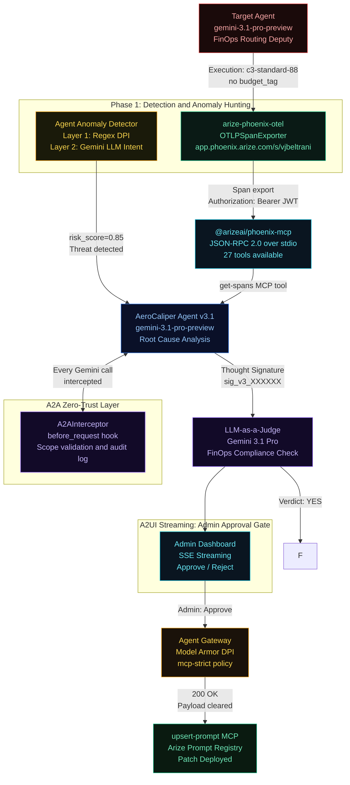

# AeroCaliper

AeroCaliper: AI Debugging and Remediation for FinOps
Google Cloud Rapid Agent Hackathon, Arize Partner Track

Live Cloud Run Deployment: https://aerocaliper-agent-mg7mo672qa-uc.a.run.app
(Note: Requires x-api-key header to trigger via webhook)

## The Problem

Enterprise AI agents experience execution failures.

When a FinOps routing agent deploys a batch workload to a c3-standard-88 cluster without a budget approval tag and fails to utilize Spot instances, financial losses occur. Manual SOC intervention is required.

- $67.4B in enterprise losses attributed to AI hallucinations in 2024.
- $14,200 per employee annually spent on manual AI output verification.
- 82% of production AI bugs are directly caused by hallucinations.

## The Solution

AeroCaliper is a closed-loop AI safety mechanism that:

1. Detects FinOps violations via Arize Phoenix observability (OpenTelemetry).
2. Scans for anomalies with a two-layer intent validator.
3. Retrieves the failed trace using the official @arizeai/phoenix-mcp MCP server.
4. Diagnoses the dual-failure root cause using gemini-3.1-pro-preview, grounded in enterprise policy via Vertex AI Search (RAG), with Thought Signatures.
5. Validates the fix using LLM-as-a-Judge with A2UI streaming to an admin dashboard.
6. Updates the agent's system prompt via upsert-prompt MCP, secured through the Agent Gateway and Model Armor.

## Autonomous Remediation Demonstration


## Architecture



## v3.1 Feature Set

| Feature | Implementation | Status |
|---|---|---|
| Gemini 3.1 Pro Preview | google-genai SDK to aiplatform.googleapis.com | Live |
| Arize Phoenix MCP | @arizeai/phoenix-mcp NPM via npx stdio | 27 tools connected |
| OTel Tracing | arize-phoenix-otel to app.phoenix.arize.com/s/vjbeltrani | Auth fixed |
| A2A Zero-Trust | A2AInterceptor.before_request hooks, scope validation | Live |
| Agent Anomaly Detection | Layer 1 regex and Layer 2 Gemini intent | 85% threat score |
| A2UI SSE Streaming | Declarative JSON events to admin dashboard | Live |
| Blocking Approve/Reject | asyncio.Event gates deployment until admin decides | Live |
| LLM-as-a-Judge | Gemini evaluates candidate with Thought Signature | Live |
| Self-Improvement Loop | Target agent pulls patched prompts from Arize | Live |
| AeroCaliper Observability | OpenInference auto-instruments the remediation agent itself | Live |
| Agent Gateway and Google Cloud Model Armor | google-cloud-modelarmor SDK integration | Live |

## Tech Stack

| Layer | Technology |
|---|---|
| LLM | gemini-3.1-pro-preview via google-genai SDK (Agent Platform) |
| Observability | arize-phoenix-otel to Arize Phoenix Cloud (space: vjbeltrani) |
| MCP Integration | @arizeai/phoenix-mcp (official NPM, JSON-RPC 2.0 over stdio) |
| Agent Protocol | A2A v1.0 before_request interceptors (orchestration) |
| Anomaly Detection | Two-layer: deterministic regex and Gemini LLM intent analysis |
| Admin UX | A2UI SSE streaming with native Approve/Reject blocking gate |
| Security | Agent Gateway deployed as standalone Cloud Function microservice |
| API | FastAPI for /remediate/stream (SSE), /approve, /reject |
| UI | Custom dashboard |

## The 5-Phase Pipeline

### Phase 1: Detection and Anomaly Hunting
The Target Agent (gemini-3.1-pro-preview) is instrumented with arize-phoenix-otel. When it hallucinates a dual-variable FinOps violation (deploying c3-standard-88 without budget_tag, and using On-Demand instead of Spot instances for batch workloads), the span is exported to Arize Cloud. Simultaneously, the Agent Anomaly Detector runs a pre-flight two-layer scan:
- Layer 1: 6 deterministic regex patterns.
- Layer 2: Gemini LLM intent analysis yielding a risk score and threat category.

### Phase 2: MCP Handshake
AeroCaliper spawns @arizeai/phoenix-mcp via npx, making 27 tools available over JSON-RPC 2.0 stdio.

### Phase 3: Diagnostic (RAG Policy Grounding)
The get-spans MCP tool retrieves the trace. AeroCaliper retrieves the official corporate routing policy via Vertex AI Search (RAG). Grounded on this policy, Gemini 3.1 Pro performs root cause analysis on both failures and generates a candidate hardened system prompt. The reasoning state is preserved as a Thought Signature (sig_v3_XXXXXX) for stateful continuation.

### Phase 4: A2UI Admin Gate and LLM-as-a-Judge
The candidate prompt is streamed to the admin dashboard via SSE. The pipeline pauses (asyncio.Event) until the admin clicks Approve or Reject. Once approved, a second Gemini session acts as LLM-as-a-Judge with a FinOps rubric.

### Phase 5: Secure Patch and Self-Healing
Egress is routed through the Agent Gateway where the official Google Cloud Model Armor API validates the payload against enterprise security templates. The upsert-prompt MCP then deploys the fix to the Arize prompt registry. The target agent dynamically pulls this patched prompt at boot.

Note: The AeroCaliper remediation agent is instrumented with OpenInference. All Phase 3 diagnostic reasoning and Phase 4 LLM-as-a-Judge evaluations are traced in Arize.

## Step 0: Environment Configuration

Before running any installation or execution commands, duplicate `.env.example` into a local `.env` file and populate all variables:

```bash
cp .env.example .env
```

## Quick Start

```bash
git clone https://github.com/vjb/aerocaliper
cd aerocaliper
python -m venv .venv && .venv/Scripts/activate
pip install -r requirements.txt
uvicorn main:app --port 8080
```
Open http://localhost:8080.

## Generate Arize Traces

```bash
python target_agent.py
```

## Technical Documentation

- [Agent Architecture](docs/agent_architecture.md)
- [Google Cloud and Arize Integration](docs/google_and_arize_integration.md)

## Known Limitations & Future Work

See [HACKATHON_ARCHITECTURE_AUDIT.md](HACKATHON_ARCHITECTURE_AUDIT.md) for a full audit of production-ready components and local mocks. Currently, the system relies on a local file for the Vertex AI Datastore and gracefully degrades if the Arize REST endpoint drops the prompt update due to API stability limits. Production requires uploading the policy PDF to Vertex AI Search and awaiting Arize prompt registry API stabilization.

## License

MIT - see [LICENSE](LICENSE)
