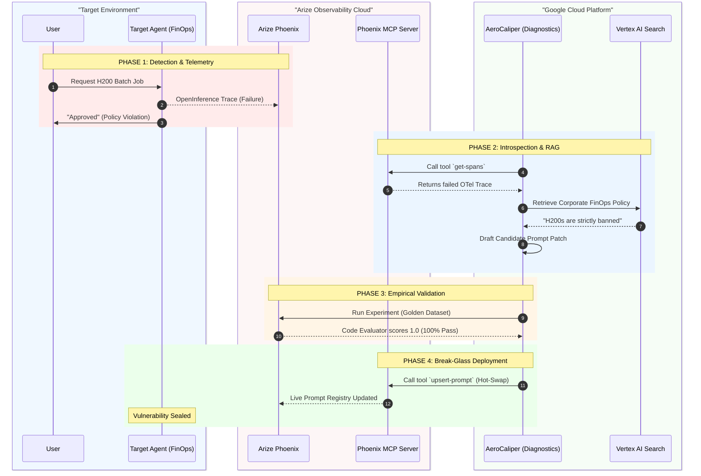

# AeroCaliper v4.0

**Autonomous AI Governance and Remediation Pipeline**

AeroCaliper is an Autonomous AI Remediation Engine that uses its own observability data to improve over time. It detects policy violations, fetches failed traces via the Arize Phoenix MCP server, and uses a Gemini-driven optimization loop to autonomously patch and redeploy its own system prompt.

Powered by the **Google Agent Platform**, **Arize Phoenix**, and the **Model Context Protocol (MCP)**, AeroCaliper seamlessly closes the loop between AI observability and continuous agent improvement.

---

## 🏆 Devpost Judging Criteria Alignment

AeroCaliper is designed specifically to hit the Google Cloud Rapid Agent Hackathon criteria:

1. **Code-Owned Agent Runtime**: AeroCaliper uses the unified `google-genai` SDK in Python to orchestrate `gemini-3.1-pro-preview` entirely via code, rather than using a visual builder.
2. **Instrument with OpenInference**: We integrated zero-touch OpenTelemetry tracing using the `openinference-instrumentation-google-genai` package to natively capture all Gemini interactions.
3. **Send Traces to Phoenix Cloud**: All execution spans and traces are securely routed to the managed Phoenix Cloud (`app.phoenix.arize.com`). We also actively sync our Golden Truth datasets directly to the cloud platform.
4. **Phoenix MCP Server for Runtime Introspection**: This is the core of AeroCaliper. Our pipeline spins up the official `@arizeai/phoenix-mcp` server via `npx`, allowing Gemini to fetch its own failed traces (`fetch_failed_traces`) and deploy prompt patches dynamically (`upsert-prompt`) at runtime.
5. **Run Evaluations (Code Evals)**: We built custom Python Code Evaluators (in `tools/evaluator.py`) that run during the autonomous backtesting phase. The results are natively logged to the Phoenix Experiments UI via `px_client.experiments.run_experiment()`.
6. **E2E Playwright/Pytest Validation Suite**: Added a robust validation framework (`tests/`) automating both the Golden Path (FinOps) and Abort Path (HR) UI transitions via Playwright.
7. **🌟 BONUS POINTS: Agents that Improve Over Time**: AeroCaliper is a self-healing Autonomous AI Governance Pipeline. It uses failed traces to diagnose its own hallucinations, RAG to inject missing policy, LLM-as-a-judge to validate fixes, and MCP to deploy the healed prompt—completely automating the improvement loop.

---

## Arize Phoenix in the Enterprise Architecture

In a modern enterprise architecture, **Arize Phoenix** serves two critical governance roles:
1. **Centralized Prompt Registry:** System prompts and agent personas are stored, versioned, and managed centrally in Arize Phoenix rather than being hardcoded in application codebases. Enterprise agents pull their active instructions dynamically at boot time (e.g., using `client.prompts.get()`).
2. **LLM Observability Backend:** All runtime steps, token usages, and inputs/outputs are instrumented via OpenTelemetry and streamed directly to Phoenix Cloud as traces, serving as a live compliance record.

### The AeroCaliper Advantage: Closing the Loop

When agents violate corporate policies (e.g., leaking PII or bypassing cost caps), standard observability simply alerts humans. Resolving the violation traditionally takes hours or days: engineers must query logs, tweak prompts in IDEs, test locally in notebooks, and push code through CI/CD pipelines.

**AeroCaliper is the self-healing orchestration layer that bridges the gap, completely automating the remediation loop in seconds:**
1. **Pulls** failed execution traces from Phoenix Observability via the MCP server.
2. **Grounds** and heals the prompt template against actual policies using Vertex AI Search RAG.
3. **Backtests** the candidate prompt against golden datasets inside the Phoenix Experimentation Sandbox.
4. **Hot-swaps** the validated, secure prompt directly back into the live **Arize Phoenix Prompt Registry** via MCP.



---

## Production Infrastructure & Reliability Upgrades

AeroCaliper v4.0 incorporates critical engineering optimizations to support production-level reliability:

### 1. Cloud Run Resource Expansion (OOM Resolution)
- **The Problem:** Spawning the Phoenix MCP server subprocess via `npx` pushed resource consumption beyond standard limits, resulting in silent Out-of-Memory (OOM) shutdowns when memory exceeded 512 MiB.
- **The Solution:** Upgraded the container limits to **2 GiB RAM and 2 vCPUs** (Revision `00067-mlh`). The pipeline now successfully runs FastAPI, Gemini SDK, OTel, and the Phoenix MCP server concurrently in ~3 minutes.

### 2. Thread-Safe Event Loop Isolation
- **The Problem:** Running Playwright/Pytest specs alongside active async wrappers raised `RuntimeError: asyncio.run() cannot be called from a running event loop` because the test runner maintains a background event loop.
- **The Solution:** Refactored [observability.py](file:///C:/Users/vjbel/.gemini/antigravity/worktrees/AeroCaliper/stress-test-aerocaliper-demo/tools/observability.py) and [evaluator.py](file:///C:/Users/vjbel/.gemini/antigravity/worktrees/AeroCaliper/stress-test-aerocaliper-demo/tools/evaluator.py) to run async operations on **dedicated child threads**, isolating the loops and ensuring E2E tests execute flawlessly.

### 3. XML Schema Tag Rendering & UI Card Display
- **The Problem:** XML tags (`<original_prompt>` and `<compliance_overrides>`) generated by the model were rendered as unformatted escaped strings in the UI.
- **The Solution:** Created a JavaScript parsing function `formatPromptHtml` in the frontend. The dashboard now isolates and displays the components inside beautifully styled UI containers:
  - 🤖 **Core Persona Instructions** (blue box)
  - 🛡️ **Hardened Compliance Overrides** (violet warning box)

---

## 🌐 Live Demo Application

Skip the local setup! You can access the live, production-grade deployment of the **AeroCaliper UI** hosted on Google Cloud Run:

👉 **[AeroCaliper Live UI](https://aerocaliper-agent-622472185650.us-central1.run.app/)**

---

## Quickstart

**Step 0: Environment Configuration**

```bash
cp .env.example .env
# Populate all required variables before proceeding.
# Required: GOOGLE_AGENT_PLATFORM_API_KEY, PHOENIX_API_KEY, GCP_PROJECT_ID,
#           ARIZE_SPACE_ID, MODEL_ARMOR_TEMPLATE, GCP_PROJECT_NUMBER
```

**Step 1: Install Dependencies**

```bash
pip install -r requirements.txt
playwright install chromium
```

**Step 2: Launch the AeroCaliper UI**

```bash
uvicorn main:app --host 127.0.0.1 --port 8080
```

**Step 3: Trigger Live Traces**

Run the target agent to simulate a workload routing decision and push OpenTelemetry traces to Arize Phoenix:

```bash
python target_agent.py --use-case finops
```

**Step 4: Execute E2E Tests**

Ensure everything functions flawlessly by running the Playwright validation tests:

```bash
pytest -v
```

**Step 5: Explore the Demo**

Navigate to `notebooks/AeroCaliper_Demo.ipynb` for an interactive, executed walkthrough demonstrating the integration between Vertex AI Search, Arize Phoenix traces, and the LLM-as-a-Judge backtesting loop.
