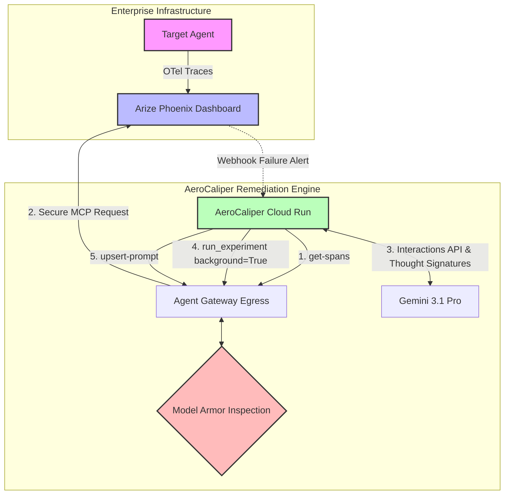

# AeroCaliper 🦅📏

**Autonomous AI Debugging and Remediation for Enterprise Cloud Environments**

AeroCaliper is a zero-trust, self-healing control plane designed to actively mitigate operational and financial risks caused by autonomous AI agents. Built specifically for the **Arize Partner Track** at the 2026 Google Cloud Rapid Agent Hackathon, AeroCaliper transcends passive observability by autonomously diagnosing hallucinations and patching system prompts in production.

## ⚠️ The Problem: The Agentic Confused Deputy
By 2026, the global financial losses attributed to AI hallucinations reached $67.4 billion. When an internal enterprise routing agent (the "Target Agent") hallucinates—such as deploying a basic workload to a massively expensive Google Cloud `X5-48TB` cluster without passing the required budget tags—the enterprise hemorrhages money instantly. Manual intervention is too slow.

## 🛠️ Our Solution
AeroCaliper transforms passive monitoring into active infrastructure orchestration using a five-phase autonomous loop:

1. **Detection:** Arize Phoenix captures the hallucinated deployment via OpenTelemetry. A deterministic code evaluator flags the missing FinOps budget tags.
2. **Governed Handshake:** AeroCaliper connects to the Arize MCP server. Crucially, this egress traffic is intercepted by **Google Cloud Agent Gateway** and sanitized by **Model Armor** to prevent supply-chain prompt injection.
3. **Stateful Diagnosis:** Using **Gemini 3.1 Pro**, AeroCaliper analyzes the failed trace. It utilizes the new **Thought Signatures** feature to preserve its encrypted reasoning state across tool calls.
4. **Background Experimentation:** Utilizing the **Interactions API** (`background=True`), AeroCaliper asynchronously triggers the Arize Prompt Learning SDK to A/B test candidate fixes against historical traces without timing out.
5. **Autonomous Patching:** AeroCaliper pushes the optimized system prompt back to the registry via MCP, permanently resolving the hallucination without human intervention.

## 🏗️ Architecture

## 🚀 Getting Started

Please see `implementation.md` for the technical architecture and budget control specifics, and `tasks.md` for the Test-Driven Development (TDD) phases.

### Prerequisites
- Google Cloud Project with Billing Enabled.
- API Keys for Gemini and Arize Phoenix configured in `.env`.
- Python 3.11+
