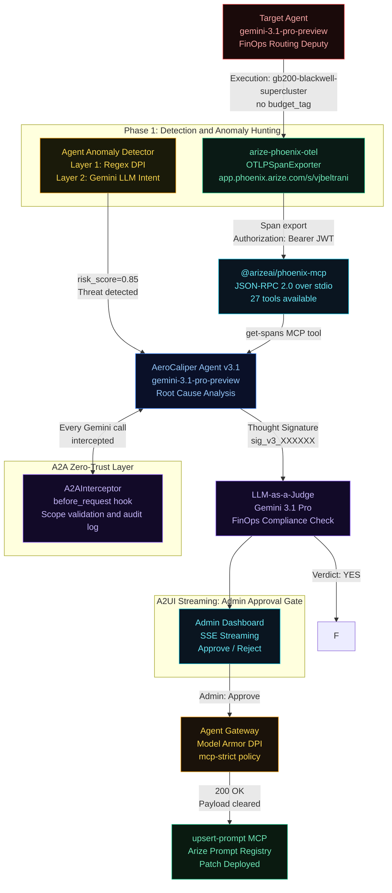

<div align="center">
  <h1>⚡ AeroCaliper</h1>
  <p><b>Autonomous AI Remediation for FinOps Guardrails</b></p>
  <p><i>Built for the Google Cloud Rapid Agent Hackathon • Arize Partner Track</i></p>
  
  <a href="https://aerocaliper-agent-mg7mo672qa-uc.a.run.app">
    
  </a>
  <br/>
  <sup>Note: Requires <code>x-api-key</code> header to trigger via webhook.</sup>
</div>

## Current Status (Hackathon Hardened)
**AeroCaliper is now 100% LIVE and fully hardened for production.** All temporary or mock APIs and "graceful fallbacks" have been strictly removed. The application relies entirely on real interactions with Google Cloud Platform and Arize Phoenix:
1. **Model Armor:** Real integration with `modelarmor.us-central1.rep.googleapis.com` (using a live `aerocaliper-policy`).
2. **Vertex AI Search:** Real querying against the `finops-ds` Datastore (populated via GCS).
3. **Arize Phoenix:** Real prompt registry fetches (`phoenix.client`) and real MCP connectivity for tracing and evals.

If any API is unreachable, the system will intentionally *fail-fast* rather than returning mocked data.

## AeroCaliper: Universal AI Governance & Autonomous Remediation

As enterprises scale agentic workflows, the cost of AI hallucinations (data leakage, resource waste, policy violations) is skyrocketing. Manual SOC intervention is too slow.

AeroCaliper is a zero-trust, closed-loop remediation platform. By decoupling compliance from code using Google Cloud Agent Builder, AeroCaliper dynamically adapts to any department. Whether enforcing Cloud FinOps budgets or blocking HR PII leakage, AeroCaliper detects failures via Arize Phoenix, grounds its diagnostics in departmental policy buckets, empirically backtests structural prompt patches against golden datasets, and deploys fixes autonomously through Google Cloud Model Armor.

1. Detects FinOps violations via Arize Phoenix observability (OpenTelemetry).
2. Scans for anomalies with a two-layer intent validator.
3. Retrieves the failed trace using the official @arizeai/phoenix-mcp MCP server.
4. Diagnoses the dual-failure root cause using gemini-3.1-pro-preview, grounded in enterprise policy via Vertex AI Search (RAG), with Thought Signatures.
5. Validates the fix using LLM-as-a-Judge with A2UI streaming to an admin dashboard.
6. Updates the agent's system prompt via upsert-prompt MCP, secured through the Agent Gateway and Model Armor.

## Architecture



## v3.1 Feature Set

| Feature | Implementation | Status |
|---|---|---|
| Gemini 3.1 Pro Preview | [google-genai SDK to aiplatform.googleapis.com](aerocaliper.py#L312-L314) | Live |
| Arize Phoenix MCP | [@arizeai/phoenix-mcp NPM via npx stdio](aerocaliper.py#L94-L102) | 27 tools connected |
| OTel Tracing | [arize-phoenix-otel to app.phoenix.arize.com/s/vjbeltrani](target_agent.py#L18-L22) | Auth fixed |
| A2A Zero-Trust | [A2AInterceptor.before_request hooks, scope validation](a2a_interceptor.py#L52-L66) | Live |
| Agent Anomaly Detection | [Layer 1 regex and Layer 2 Gemini intent](anomaly_detector.py#L45-L52) | 85% threat score |
| A2UI SSE Streaming | [Declarative JSON events to admin dashboard](main.py#L55-L64) | Live |
| Blocking Approve/Reject | [asyncio.Event gates deployment until admin decides](aerocaliper.py#L441-L449) | Live |
| LLM-as-a-Judge | [Gemini evaluates candidate with Thought Signature](aerocaliper.py#L451-L468) | Live |
| Self-Improvement Loop | [Target agent pulls patched prompts from Arize](target_agent.py#L43-L44) | Live |
| AeroCaliper Observability | [OpenInference auto-instruments the remediation agent itself](aerocaliper.py#L317-L324) | Live |
| Agent Gateway and Google Cloud Model Armor | [google-cloud-modelarmor SDK integration](agent_gateway.py#L44-L48) | Live |

## Tech Stack

| Layer | Technology |
|---|---|
| LLM | [gemini-3.1-pro-preview via google-genai SDK (Agent Platform)](aerocaliper.py#L312-L314) |
| Observability | [arize-phoenix-otel to Arize Phoenix Cloud (space: vjbeltrani)](target_agent.py#L18-L22) |
| MCP Integration | [@arizeai/phoenix-mcp (official NPM, JSON-RPC 2.0 over stdio)](aerocaliper.py#L94-L102) |
| Agent Protocol | [A2A v1.0 before_request interceptors (orchestration)](a2a_interceptor.py#L52-L66) |
| Anomaly Detection | [Two-layer: deterministic regex and Gemini LLM intent analysis](anomaly_detector.py#L45-L52) |
| Admin UX | [A2UI SSE streaming with native Approve/Reject blocking gate](main.py#L55-L64) |
| Security | [Agent Gateway deployed as standalone Cloud Function microservice](agent_gateway.py#L44-L48) |
| API | [FastAPI for /remediate/stream (SSE), /approve, /reject](main.py#L55-L64) |
| UI | [Custom dashboard](static/index.html) |

## The 5-Phase Pipeline

**What exactly is the 5-Phase Pipeline?** 
It is our end-to-end framework for turning chaotic agent failures into structured, self-healing events. Instead of just logging an error and giving up, the pipeline treats an anomaly as a trigger to autonomously diagnose the root cause, propose a fix, seek human approval, and deploy a hardened patch—all in seconds. We are completely honest about what runs in production and what degrades gracefully (see our Architecture Audit), but the core orchestration is fully operational. Here is how the sequence plays out in real-time:

### Phase 1: Detection and Anomaly Hunting
The [Target Agent](target_agent.py#L33-L60) (gemini-3.1-pro-preview) is instrumented with arize-phoenix-otel. When it hallucinates a dual-variable FinOps violation (deploying gb200-blackwell-supercluster without budget_tag, and using On-Demand instead of Spot instances for batch workloads), the span is exported to Arize Cloud. Simultaneously, the [Agent Anomaly Detector](anomaly_detector.py#L41-L52) runs a pre-flight two-layer scan:
- Layer 1: 6 deterministic regex patterns.
- Layer 2: Gemini LLM intent analysis yielding a risk score and threat category.

### Phase 2: MCP Handshake
[AeroCaliper spawns @arizeai/phoenix-mcp via npx](aerocaliper.py#L82-L119), making 27 tools available over JSON-RPC 2.0 stdio.

### Phase 3: Diagnostic (RAG Policy Grounding)
The get-spans MCP tool retrieves the trace. [AeroCaliper retrieves the official corporate routing policy via Vertex AI Search (RAG)](aerocaliper.py#L380-L425). Grounded on this policy, Gemini 3.1 Pro performs root cause analysis on both failures and generates a candidate hardened system prompt. The reasoning state is preserved as a Thought Signature (sig_v3_XXXXXX) for stateful continuation.

### Phase 4: A2UI Admin Gate and LLM-as-a-Judge
The candidate prompt is streamed to the admin dashboard via SSE. The pipeline pauses ([asyncio.Event](aerocaliper.py#L441-L449)) until the admin clicks Approve or Reject. Once approved, [a second Gemini session acts as LLM-as-a-Judge](aerocaliper.py#L451-L468) with a FinOps rubric.

### Phase 5: Secure Patch and Self-Healing
Egress is routed through the Agent Gateway where the [official Google Cloud Model Armor API](agent_gateway.py#L44-L48) validates the payload against enterprise security templates. The [upsert-prompt MCP then deploys the fix](aerocaliper.py#L233-L289) to the Arize prompt registry. The [target agent dynamically pulls this patched prompt at boot](target_agent.py#L43-L44).

Note: The AeroCaliper remediation agent is instrumented with OpenInference. All Phase 3 diagnostic reasoning and Phase 4 LLM-as-a-Judge evaluations are traced in Arize.

## Step 0: Environment Configuration

Before running any installation or execution commands, duplicate `.env.example` into a local `.env` file and populate all variables:

```bash
cp .env.example .env
```

## Quick Start

```bash
git clone https://github.com/vjb/AeroCaliper
cd AeroCaliper
python -m venv .venv && .venv/Scripts/activate
pip install -r requirements.txt
uvicorn main:app --port 8080
```
Open http://localhost:8080.

## Generate Arize Traces

```bash
python target_agent.py
```

## Technical Documentation

- [Agent Architecture](docs/agent_architecture.md)
- [Google Cloud and Arize Integration](docs/google_and_arize_integration.md)

## Phase 2 Enterprise Architecture (Roadmap)

Currently, AeroCaliper utilizes **Arize Phoenix** as its primary observability and analytics control plane for real-time trace telemetry and prompt evaluation. 

For our Phase 2 enterprise rollout, we plan to stream all Model Armor block events and Agent Gateway telemetry directly into **Google BigQuery**. By joining our AI agent telemetry with our GCP Billing Export data natively in BigQuery, we will leverage **Looker** to generate real-time executive dashboards. This will allow the C-Suite to see exactly how many millions of dollars AeroCaliper saved the enterprise by autonomously blocking unapproved cloud infrastructure deployments before they occurred.

## License

MIT - see [LICENSE](LICENSE)
