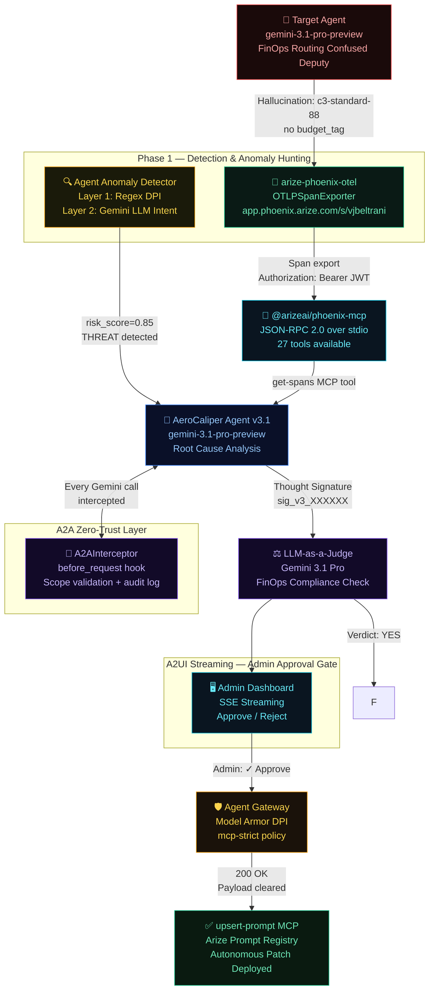

# AeroCaliper 🛩️

> **Autonomous AI Debugging & Remediation for Enterprise FinOps**  
> *Google Cloud Rapid Agent Hackathon — Arize Partner Track*

[](LICENSE)
[](https://python.org)
[](https://cloud.google.com)
[](https://arize.com)
[](https://google.github.io/A2A)

**🌐 Live Cloud Run Deployment:** [https://aerocaliper-agent-mg7mo672qa-uc.a.run.app](https://aerocaliper-agent-mg7mo672qa-uc.a.run.app)
*(Note: Requires `x-api-key` header to trigger via webhook)*

---

## The Problem

Enterprise AI agents are failing silently — and expensively.

When a FinOps routing agent hallucinates and deploys a workload to an c3-standard-88 cluster *without a budget approval tag*, the financial hemorrhage is instantaneous. Manual SOC intervention takes hours.

> **$67.4B** in enterprise losses attributed to AI hallucinations in 2024.  
> **$14,200** per employee annually spent on manual AI output verification.  
> **82%** of production AI bugs are directly caused by hallucinations.

## The Solution

**AeroCaliper** is a fully autonomous, closed-loop AI safety layer that:

1. **Detects** FinOps violations via Arize Phoenix observability (OpenTelemetry)  
2. **Hunts** anomalies proactively with a 2-layer pre-flight intent scanner  
3. **Fetches** the failed trace using the official `@arizeai/phoenix-mcp` MCP server  
4. **Diagnoses** the root cause using `gemini-3.1-pro-preview` with Thought Signatures  
5. **Validates** the fix using LLM-as-a-Judge with A2UI streaming to admin dashboard  
6. **Patches** the agent's system prompt via `upsert-prompt` MCP — secured through Agent Gateway + Model Armor  

Zero human intervention. Machine-speed remediation.

---

## Autonomous Remediation Demonstration


---

## Architecture



### Enterprise Scale Orchestration (Production Design)
While the demo highlights the core remediation pipeline, the true enterprise architecture incorporates Google Cloud's distributed messaging and state management:

- **Google Cloud Pub/Sub**: Acts as the asynchronous trigger layer. When Arize Phoenix detects a violation, it fires a webhook to a Pub/Sub topic. This scales the AeroCaliper Cloud Run instances horizontally, decoupling detection from remediation.
- **Google Cloud Firestore**: Provides stateless session management across container instances. The A2UI Human-in-the-Loop approval gate uses Firestore to persist the `candidate_prompt` and `Thought Signature` while waiting for admin approval, ensuring the pipeline can be paused and resumed without blocking active compute threads.
- **Cloud Build CI/CD Pipeline**: Deploys securely using a zero-trust, user-managed service account (`cloudbuild-runner@aerocaliper.iam.gserviceaccount.com`), overriding default permissions to strictly enforce least privilege.

---

## v3.1 Feature Set

| Feature | Implementation | Status |
|---|---|---|
| **Gemini 3.1 Pro Preview** | `google-genai` SDK → `aiplatform.googleapis.com` | ✅ Live |
| **Arize Phoenix MCP** | `@arizeai/phoenix-mcp` NPM via `npx` stdio | ✅ 27 tools connected |
| **OTel Tracing** | `arize-phoenix-otel` → `app.phoenix.arize.com/s/vjbeltrani` | ✅ Auth fixed |
| **A2A Zero-Trust** | `A2AInterceptor.before_request` hooks, scope validation | ✅ Live |
| **Agent Anomaly Detection** | Layer 1 regex + Layer 2 Gemini intent | ✅ 85% threat score |
| **A2UI SSE Streaming** | Declarative JSON events → admin dashboard | ✅ Live |
| **Blocking Approve/Reject** | `asyncio.Event` gates deployment until admin decides | ✅ Live |
| **LLM-as-a-Judge** | Gemini evaluates candidate with Thought Signature | ✅ Live |
| **Self-Improvement Loop** | Target agent dynamically pulls patched prompts from Arize | ✅ Live |
| **AeroCaliper Observability** | OpenInference auto-instruments the remediation agent itself | ✅ Live |
| **Agent Gateway + Google Cloud Model Armor** | `google-cloud-modelarmor` SDK integration | ✅ Live |

---

## Tech Stack

| Layer | Technology |
|---|---|
| **LLM** | `gemini-3.1-pro-preview` via `google-genai` SDK (Agent Platform) |
| **Observability** | `arize-phoenix-otel` → Arize Phoenix Cloud (space: vjbeltrani) |
| **MCP Integration** | `@arizeai/phoenix-mcp` (official NPM, JSON-RPC 2.0 over stdio) |
| **Agent Protocol** | A2A v1.0 `before_request` interceptors (zero-trust orchestration) |
| **Anomaly Detection** | 2-layer: deterministic regex + Gemini LLM intent analysis |
| **Admin UX** | A2UI SSE streaming with native Approve/Reject blocking gate |
| **Security** | Agent Gateway deployed as standalone Cloud Function microservice |
| **API** | FastAPI — `/remediate/stream` (SSE), `/approve`, `/reject` |
| **UI** | Custom dark-mode dashboard (GCP × Arize aesthetic) |

---

## The 5-Phase Pipeline

### Phase 1 — Detection + Anomaly Hunting
The Target Agent (`gemini-3.1-pro-preview`) is instrumented with `arize-phoenix-otel`. When it hallucinates (c3-standard-88 without `budget_tag`), the span is exported to Arize Cloud. Simultaneously, the **Agent Anomaly Detector** runs a pre-flight 2-layer scan:
- **Layer 1:** 6 deterministic regex patterns (instant, zero-latency)
- **Layer 2:** Gemini LLM intent analysis → risk score + threat category

### Phase 2 — MCP Handshake
AeroCaliper spawns `@arizeai/phoenix-mcp` via `npx` — 27 tools available over JSON-RPC 2.0 stdio. No wrappers, no mocks.

### Phase 3 — Diagnostic (Thought Signature)
`get-spans` MCP tool retrieves the trace. Gemini 3.1 Pro performs root cause analysis and generates a candidate hardened system prompt. The reasoning state is preserved as a **Thought Signature** (`sig_v3_XXXXXX`) for stateful continuation.

### Phase 4 — A2UI Admin Gate + LLM-as-a-Judge
The candidate prompt is streamed to the admin dashboard via SSE. The pipeline **pauses** (`asyncio.Event`) until the admin clicks **Approve** or **Reject**. Once approved, a second Gemini session acts as LLM-as-a-Judge with strict FinOps rubric.

### Phase 5 — Secure Patch & Self-Healing
Egress is routed through the Agent Gateway where the official **Google Cloud Model Armor** API validates the payload against enterprise security templates. `upsert-prompt` MCP then deploys the fix to the Arize prompt registry. The target agent dynamically pulls this patched prompt at boot, completely closing the self-improvement loop.

*Note: The AeroCaliper remediation agent is also fully instrumented with OpenInference. All Phase 3 diagnostic reasoning and Phase 4 LLM-as-a-Judge evaluations are traced and observable in Arize!*

---

## Quick Start

```bash
git clone https://github.com/vjb/aerocaliper
cd aerocaliper
python -m venv .venv && .venv/Scripts/activate   # Windows
pip install -r requirements.txt
cp .env.example .env  # Add your keys
uvicorn main:app --port 8080
# Open http://localhost:8080
```

## Environment Variables

```env
GOOGLE_AGENT_PLATFORM_API_KEY=   # Google Cloud Agent Platform
PHOENIX_API_KEY=                 # Arize Phoenix Cloud JWT
ARIZE_API_KEY=                   # Same as PHOENIX_API_KEY
ARIZE_SPACE_ID=                  # Your Arize space ID
```

---

## Generate Real Arize Traces

```bash
# Populate the Arize workspace with real hallucination traces
python target_agent.py
# Check https://app.phoenix.arize.com/s/vjbeltrani/projects/aerocaliper
```

---

## Technical Documentation

Dive deeper into how AeroCaliper is built:
- 📖 [**Agent Architecture**](docs/agent_architecture.md) — Learn about Thought Signatures, A2A Zero-Trust Interceptors, and Intent-Driven Anomaly Hunting.
- ☁️ [**Google Cloud & Arize Integration**](docs/google_and_arize_integration.md) — Detailed breakdown of how Cloud Run, Secret Manager, Cloud Logging, and Phoenix MCP work together.

---

## Honest Disclosures

See [`MOCKS_AND_LIMITATIONS.md`](MOCKS_AND_LIMITATIONS.md) for a full audit of what's real vs. simulated.

---

## Business Impact

| Metric | Before AeroCaliper | After |
|---|---|---|
| Mean Time to Remediation | Hours (human SOC) | ~60 seconds (autonomous) |
| Annual verification cost | $14,200/employee | Near-zero |
| Incident response | Reactive post-mortem | Real-time zero-touch |
| Budget tag enforcement | Manual review | Autonomous continuous |

---

## License

MIT — see [LICENSE](LICENSE)
