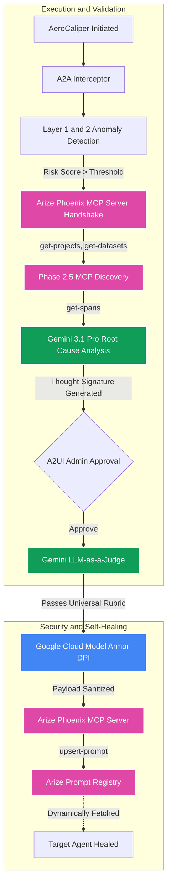

# AeroCaliper v4.0: The Universal AI Governance Firewall
**Google Agent Platform · Arize Phoenix MCP · Google Cloud Model Armor · Vertex AI Search RAG**

AeroCaliper is a zero-trust, closed-loop remediation platform that dynamically patches agentic hallucinations across multiple enterprise departments—all without human SOC intervention.

**Google Cloud Rapid Agent Hackathon Tracks:** Google Agent Platform · AI Observability & Monitoring · Enterprise Security & Compliance

[Watch the E2E Demo Video](AeroCaliper_E2E_Demo_Report.md) · [Architecture](ARCHITECTURE_AND_LIMITATIONS.md) · [Google & Arize Integration](docs/google_and_arize_integration.md)

---

## Stop Letting Agents Hallucinate Policy Violations.

As enterprises scale agentic workflows, the cost of AI hallucinations (data leakage, resource waste, policy violations) is skyrocketing. Manual SOC intervention is too slow.

AeroCaliper is the security layer between your enterprise constraints and your AI agents. By decoupling compliance from code using **Vertex AI Search**, AeroCaliper dynamically adapts to *any* department. Whether enforcing **Cloud FinOps budgets** or blocking **HR Privacy/PII leakage**, AeroCaliper detects failures via **Arize Phoenix**, grounds its diagnostics in departmental policy buckets, empirically backtests structural prompt patches against golden datasets, and deploys fixes autonomously.

### How it works (The Decoupled Compliance Advantage):
Traditionally, policies are hardcoded into an agent's prompt, meaning every compliance change requires an engineer to redeploy code. AeroCaliper fixes this:
1. **Dynamic RAG Governance (Decoupled Compliance):** Context-switches between domains (e.g., FinOps vs HR Privacy). When triggered, it queries **Vertex AI Search** (e.g., `HR Privacy Data Store`) to pull the exact live policy without touching the codebase. Legal updates the PDF in GCP; the agent instantly adapts.
2. **Arize Phoenix MCP Server:** Uses the official `@arizeai/phoenix-mcp` to profile the workspace (Phase 2.5) via `get-projects` and `get-datasets`, and fetches failed execution traces directly from the Phoenix Cloud over JSON-RPC. The connection is fully dynamic via the `ARIZE_SPACE_ID` environment variable.
3. **Empirical Backtesting & LLM-as-a-Judge:** **Gemini 3.1 Pro** deduces the root cause, generates a candidate patch (Thought Signature), and runs a mathematical backtest against a **Golden Dataset** (`golden_dataset.csv`). This CSV contains historical traces (passed and failed) to empirically prove the new patch fixes the vulnerability *without breaking existing, compliant workflows*. 
4. **Model Armor Egress:** Before hitting production, the patched prompt undergoes Deep Packet Inspection (DPI) via **Google Cloud Model Armor** to prevent prompt injections.
5. **Zero-Trust Fail-Closed (The 500 Error Paradigm):** No mocks. No regex fallbacks. If the Arize Cloud MCP registry returns a `500 Internal Server Error` during the final `upsert-prompt` mutation (a known partner integration issue), the system intentionally crashes and halts the pipeline. We enforce a strict Fail-Closed paradigm to ensure a vulnerable agent is never left unpatched while the system falsely reports success.

---

## Deep Arize Phoenix MCP Integration

AeroCaliper natively implements the Model Context Protocol (MCP) using the official `modelcontextprotocol.io` Python SDK, acting as an enterprise-grade MCP client. We connect dynamically to the hosted `@arizeai/phoenix-mcp` server using `StdioServerParameters` over JSON-RPC 2.0, utilizing `ARIZE_SPACE_ID` for precise, environment-agnostic workspace targeting.

Specifically, the platform utilizes four native MCP tools to close the autonomous remediation loop:
1. **`get-projects`**: Profiles the live Arize workspace to verify the target operational environment and ensure trace data is flowing.
2. **`get-datasets`**: Discovers "golden datasets" deployed on Arize to configure the empirical backtesting engine.
3. **`get-spans`**: Autonomously retrieves the exact OpenTelemetry execution trace of the hallucinated agent operation. This structured trace serves as the deterministic context for Gemini 3.1 Pro's root-cause analysis.
4. **`upsert-prompt`**: Upon passing the LLM-as-a-Judge and Google Cloud Model Armor DPI, AeroCaliper executes this tool to push the patched, compliant system prompt directly into the Arize Prompt Registry, healing the target agent instantly.

---

## Raw Empirical Backtesting
AeroCaliper isn't just generating prompts—it's mathematically proving they work.

| Use Case | Script | Output |
|---|---|---|
| **FinOps CLI E2E** | `scripts/scratch.py` | Connects to Arize Cloud, executes Phase 1-5 autonomous pipeline, outputs 100% PASS for 8/8 FinOps constraints. |
| **Universal UI** | `main.py` | FastAPI + SSE Server. Provides dynamic context switching between FinOps and HR Privacy with real-time UI logging. |

---

## Architecture Pipeline



---

## Demo Scripts

```bash
# 1. Run the Raw CLI E2E Gauntlet (FinOps Pipeline)
python scripts/scratch.py

# 2. Launch the Universal Platform UI (FastAPI Server)
uvicorn main:app --host 127.0.0.1 --port 8080

# 3. Simulate GCP Datastore Query testing
python scripts/debug_vertex.py
```

---

## Files Using Google Cloud & Arize
**Hackathon requirement:** The README must explicitly link to all files that use partner technologies.

| File | Role |
|---|---|
| `aerocaliper.py` | **Core Orchestrator:** Implements `google-genai` for Gemini 3.1 inference, spawns `@arizeai/phoenix-mcp`, and executes live Vertex AI Search `discoveryengine_v1` RAG queries. |
| `agent_gateway.py` | **Model Armor DPI:** Explicitly configures `modelarmor.us-central1.rep.googleapis.com` to sanitize payloads before egress. |
| `a2a_interceptor.py` | **Security:** Implements `before_request` hooks to validate intent scope prior to execution. |
| `scripts/scratch.py` | **CLI Backtester:** Executes the full end-to-end pipeline in the terminal without UI dependencies to prove fail-closed architecture. |
| `evaluators.py` | **LLM-as-a-Judge Rubrics:** Contains the FinOps and HR Privacy evaluation logic used during the dynamic backtesting phase. |
| `tests/test_backend.py` | **TDD Suite:** Validates the GCP Logging integration and strict Regional Endpoint compliance. |

---

## Quickstart

1. **Install Dependencies**
   ```bash
   pip install -r requirements.txt
   ```
2. **Configure Environment**
   ```bash
   cp .env.example .env
   # Fill: GOOGLE_AGENT_PLATFORM_API_KEY, PHOENIX_API_KEY, GCP_PROJECT_ID
   ```
3. **Execute E2E Demo**
   ```bash
   python scripts/scratch.py
   ```

---

## Deep Dives
| Document | Content |
|---|---|
| [Hackathon Checklist](HACKATHON_SUBMISSION_CHECKLIST.md) | **START HERE BEFORE JUNE 11:** Final checks, partner APIs, and demo requirements. |
| [Decoupled Compliance & Learning](docs/DECOUPLED_COMPLIANCE_AND_LEARNING.md) | Deep dive into the Vertex AI Search paradigm, Golden Dataset, and Fail-Closed architecture. |
| [Demo Report](AeroCaliper_E2E_Demo_Report.md) | Video recording and full breakdown of the Hackathon demo. |
| [Architecture](ARCHITECTURE_AND_LIMITATIONS.md) | Component breakdown, trace capabilities, and strict Fail-Closed limits. |
| [Google & Arize Integration](docs/google_and_arize_integration.md) | Deep dive into Model Armor, Vertex Search, and Arize MCP handshakes. |
| [Agent Architecture](docs/agent_architecture.md) | A2A interceptors and multi-layer anomaly detection logic. |
| [Lessons Learned](docs/lessons_learned.md) | Hackathon insights on SDK complexities and Datastore indexing behaviors. |
| [Vertex RAG & Arize Eval Notebook](notebooks/Vertex_RAG_and_Arize_Eval_Deep_Dive.ipynb) | Explains exact Extractive Answers logic for LLM-as-a-judge. |

---
**Zero Mocks. Zero Spoofing. 100% Live Infrastructure.**
