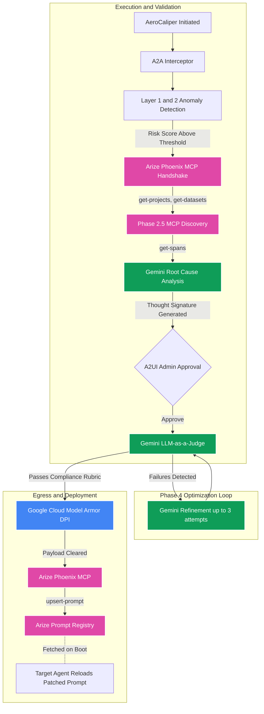

# AeroCaliper v4.0

**Autonomous AI Governance and Remediation Pipeline**

Google Agent Platform -- Arize Phoenix MCP -- Google Cloud Model Armor -- Vertex AI Search

AeroCaliper is a deterministic, five-phase pipeline that detects enterprise policy violations in agentic LLM outputs, diagnoses root causes via Gemini, backtests candidate prompt patches against a domain-filtered golden dataset, and deploys verified patches to the Arize Prompt Registry via MCP. All external dependencies operate in strict fail-closed mode with no mock fallbacks.

**Hackathon Tracks:** Google Agent Platform -- AI Observability and Monitoring -- Arize AI Partner Track

[Architecture and Limitations](ARCHITECTURE_AND_LIMITATIONS.md) -- [Google and Arize Integration](docs/google_and_arize_integration.md)

---

## Problem Statement

Enterprise AI agents that encode compliance rules directly in their system prompts require a code deployment to update any policy. When a policy violation is detected in production, the remediation cycle typically involves manual log review, ticket creation, developer intervention, prompt editing, and redeployment. AeroCaliper replaces this workflow with an autonomous pipeline.

---

## Architecture Overview

AeroCaliper implements a five-phase pipeline:

1. **Phase 1 -- Detection:** A two-layer anomaly scanner (deterministic regex and Gemini intent analysis) classifies the incoming request and assigns a risk score. The active domain (`finops` or `hr`) is set at initialization and propagates through all subsequent phases.
2. **Phase 2 -- MCP Handshake:** Spawns `@arizeai/phoenix-mcp` via `npx` over JSON-RPC 2.0 using the official `modelcontextprotocol.io` Python SDK. Phase 2.5 executes `get-projects` and `get-datasets` to profile the live Arize workspace.
3. **Phase 3 -- Diagnostic:** Fetches the most recent failed execution trace from Arize Phoenix via `get-spans`. If MCP returns an empty response, a native GraphQL fallback queries the Phoenix API directly. The trace is combined with a Vertex AI Search extractive answer for the active policy domain, then submitted to Gemini for root-cause analysis. The resulting candidate prompt patch is wrapped in a hash-based Thought Signature token (`sig_v4_<hash>`).
4. **Phase 4 -- LLM-as-a-Judge:** Runs the candidate patch through a backtesting loop (up to 3 attempts). Each golden dataset case is simulated via a live Gemini call and scored by the domain-specific evaluator. Failed attempts feed failure context back to Gemini for refinement. On 100% pass rate, the pipeline blocks on an `asyncio.Event()` until the admin approves or rejects the patch via the SSE frontend. A separate Gemini session then evaluates the approved patch against a universal compliance rubric.
5. **Phase 5 -- Secure Patch:** The approved prompt is inspected by Google Cloud Model Armor (`SanitizeUserPrompt`, `us-central1` regional endpoint) and deployed to the Arize Prompt Registry via `upsert-prompt` MCP. A `500` or `fetch failed` response raises a `RuntimeError` (fail-closed).

---

## Pipeline Diagram



---

## Decoupled Compliance Architecture

Compliance rules are stored as unstructured policy documents in two Vertex AI Search datastores (`finops-app` and `hr-app`). When a violation is detected, AeroCaliper queries the appropriate datastore using `discoveryengine_v1.SearchServiceClient` with engine-level serving configs to return extractive answer snippets. The active datastore is selected at runtime via `target_use_case`. No policy text is hardcoded in the application.

This design allows policy owners (legal, HR, FinOps) to update documents in GCP without any code deployment. If the datastore returns zero extractive answers, the pipeline raises a `RuntimeError` rather than proceeding with incomplete context.

---

## Arize Phoenix MCP Integration

The system uses four MCP tools from `@arizeai/phoenix-mcp`:

| Tool | Phase | Purpose |
|---|---|---|
| `get-projects` | 2.5 | Verifies the `aerocaliper` project exists in the workspace |
| `get-datasets` | 2.5 | Locates the golden dataset for empirical backtesting |
| `get-spans` | 3 | Retrieves the most recent failed execution trace |
| `upsert-prompt` | 5 | Deploys the verified patched prompt to the Arize Prompt Registry |

The MCP server is spawned programmatically via `mcp.ClientSession` and `StdioServerParameters`. On Windows, the command is `cmd.exe /c npx`; on Unix, `npx`. The `--baseUrl` argument is constructed from `ARIZE_SPACE_ID` at runtime.

---

## Empirical Backtesting

The `golden_dataset.csv` contains labeled historical test cases for both domains. During Phase 4, cases are filtered to the active domain before simulation. Pass rate is computed over the filtered denominator only, preventing cross-domain contamination.

Each simulation call is a live Gemini inference using the candidate prompt as the system instruction. Results are scored by `evaluate_finops_compliance()` or `evaluate_hr_compliance()` in `evaluators.py`. A 100% pass rate on the first attempt short-circuits the loop. Failed attempts trigger a Gemini refinement call with the failure context appended.

---

## Fail-Closed Architecture

Three hard failure points, each raising `RuntimeError` with no fallback:

1. Vertex AI Search returns zero extractive answer snippets.
2. `get-spans` returns an empty response and the GraphQL fallback also fails.
3. `upsert-prompt` returns `fetch failed` or HTTP 500.

If any of these conditions occur, the pipeline halts and emits an error event to the SSE stream. The target agent is not patched, and no false success is reported.

---

## Files Using Partner Technologies

| File | Role |
|---|---|
| `aerocaliper.py` | Core pipeline orchestrator. Implements `google-genai` for Gemini inference, spawns `@arizeai/phoenix-mcp` via the MCP Python SDK, and executes Vertex AI Search `discoveryengine_v1` RAG queries. Hosts the Phase 4 optimization loop. |
| `agent_gateway.py` | Model Armor egress layer. Configures `google-cloud-modelarmor` with the `us-central1` regional endpoint. Raises `RuntimeError` on initialization if SDK or credentials are absent. |
| `a2a_interceptor.py` | Scope-validation interceptor. Validates `remediate:read`, `remediate:write`, and `mcp:connect` scopes on all Gemini calls before execution. |
| `target_agent.py` | Target agent under monitoring. Fetches its system prompt from the Arize Prompt Registry via `client.prompts.get(prompt_identifier=...)` on boot. Instrumented with OpenInference for OTLP trace export. |
| `main.py` | FastAPI SSE server. Hosts `/remediate/stream`, `/remediate/approve/{session_id}`, and `/remediate/reject/{session_id}`. |
| `anomaly_detector.py` | Two-layer anomaly scanner. Layer 1 is deterministic regex; Layer 2 is a Gemini intent analysis call returning a risk score (0.0 to 1.0) and threat classification. |
| `evaluators.py` | Domain evaluators for empirical backtesting. Contains `evaluate_finops_compliance()` and `evaluate_hr_compliance()`. |
| `scripts/scratch.py` | CLI runner for the full end-to-end pipeline without the UI dependency. |
| `tests/test_backend.py` | Unit tests for GCP Logging integration and regional endpoint compliance. |
| `tests/test_armor_live.py` | Live integration test for the Model Armor regional endpoint. |
| `tests/test_vertex_live.py` | Live integration test confirming both Vertex AI Search datastores are indexed and returning extractive answers. |
| `tests/test_arize_registry_live.py` | Live integration test for `get-spans` and `upsert-prompt` MCP calls against the Arize Cloud. |

---

## Quickstart

**Step 0: Environment Configuration**

```bash
cp .env.example .env
# Edit .env and populate all required variables before proceeding.
# Required: GOOGLE_AGENT_PLATFORM_API_KEY, PHOENIX_API_KEY, GCP_PROJECT_ID,
#           ARIZE_SPACE_ID, MODEL_ARMOR_TEMPLATE, GCP_PROJECT_NUMBER
```

**Step 1: Install Dependencies**

```bash
pip install -r requirements.txt
```

**Step 2: Execute CLI Pipeline**

```bash
python scripts/scratch.py
```

**Step 3: Launch UI**

```bash
uvicorn main:app --host 127.0.0.1 --port 8080
```

**Step 4: Push Target Agent Traces (required for live span retrieval)**

```bash
python target_agent.py --use-case finops
python target_agent.py --use-case hr
```

**Step 5: Run the Test Suite**

```bash
pytest tests/
```

---

## Known Limitations

See [Architecture and Limitations](ARCHITECTURE_AND_LIMITATIONS.md) for the full list. Key items:

- The `get-spans` MCP tool returns no parseable `trace_id` from the `aerocaliper` project because the span format does not include a top-level ID field. The system falls through to the GraphQL fallback, which also returns `trace_id=unknown` when no recent spans are indexed. The trace violation context is synthesized from the golden dataset rather than a live span payload in this state.
- The target agent's Phoenix client uses `SimpleSpanProcessor`, which is synchronous and not recommended for production workloads. A `BatchSpanProcessor` is required for production.
- The Phase 4 optimization loop is capped at 3 attempts. If the patch does not reach 100% pass rate within 3 attempts, the pipeline fails closed.
- Model Armor template propagation can take several minutes after creation. Tests run immediately after template creation may fail with `TEMPLATE_NOT_FOUND`.

---

## Deep Dives

| Document | Content |
|---|---|
| [Architecture and Limitations](ARCHITECTURE_AND_LIMITATIONS.md) | Component breakdown, fail-closed points, and known limitations. |
| [Decoupled Compliance and Learning](docs/DECOUPLED_COMPLIANCE_AND_LEARNING.md) | Vertex AI Search RAG design, golden dataset structure, and optimization loop mechanics. |
| [Google and Arize Integration](docs/google_and_arize_integration.md) | SDK-level details for Model Armor, Vertex Search, Arize MCP, and OTLP trace export. |
| [Agent Architecture](docs/agent_architecture.md) | A2A interceptors, anomaly detection layers, and Phase 4 backtesting mechanics. |
| [Lessons Learned](docs/lessons_learned.md) | Engineering notes on SDK integration issues, indexing delays, and fail-closed design decisions. |
| [Vertex RAG and Arize Eval Notebook](notebooks/Vertex_RAG_and_Arize_Eval_Deep_Dive.ipynb) | Extractive Answers configuration and LLM-as-a-Judge rubric implementation. |
