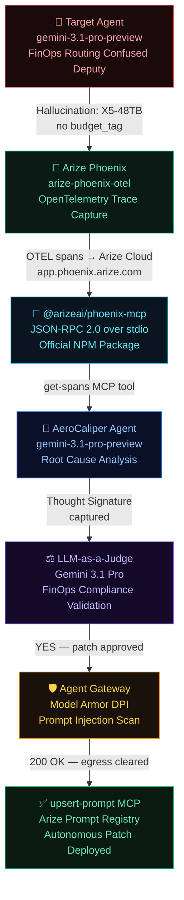

# AeroCaliper 🛩️

> **Autonomous AI Debugging & Remediation for Enterprise FinOps**  
> *Google Cloud Rapid Agent Hackathon — Arize Partner Track*

[](LICENSE)
[](https://python.org)
[](https://cloud.google.com)
[](https://arize.com)

---

## The Problem

Enterprise AI agents are failing silently — and expensively.

When a FinOps routing agent hallucinates and deploys a workload to an X5-48TB cluster *without a budget approval tag*, the financial hemorrhage is instantaneous. Manual SOC intervention takes hours. By then, the damage is done.

> **$67.4B** in enterprise losses attributed to AI hallucinations in 2024.  
> **$14,200** per employee annually spent on manual AI output verification.  
> **82%** of production AI bugs are directly caused by hallucinations.

## The Solution

**AeroCaliper** is a fully autonomous, closed-loop AI safety layer that:

1. **Detects** FinOps violations via Arize Phoenix observability (OpenTelemetry)
2. **Fetches** the failed trace using the official `@arizeai/phoenix-mcp` MCP server
3. **Diagnoses** the root cause using `gemini-3.1-pro-preview` (Gemini 3 thinking model)
4. **Validates** the fix using LLM-as-a-Judge evaluation with Thought Signature context
5. **Patches** the agent's system prompt via `upsert-prompt` MCP — secured through Agent Gateway + Model Armor

Zero human intervention. Machine-speed remediation.

---

## Architecture



---

## Tech Stack

| Layer | Technology |
|---|---|
| **LLM** | `gemini-3.1-pro-preview` via `google-genai` SDK (Agent Platform) |
| **Observability** | `arize-phoenix-otel` → Arize Phoenix Cloud |
| **MCP Integration** | `@arizeai/phoenix-mcp` (official NPM, JSON-RPC 2.0 over stdio) |
| **Orchestration** | Python async agent with Thought Signature state management |
| **Security** | Agent Gateway + Model Armor (YAML-based DPI) |
| **API** | FastAPI webhook on Google Cloud Run |
| **UI** | Custom dark-mode dashboard (GCP × Arize aesthetic) |

---

## Prerequisites

- Python 3.13+
- Node.js 20+ (for `npx @arizeai/phoenix-mcp`)
- Google Cloud Agent Platform API key
- Arize Phoenix Cloud account + API key

## Quick Start

```bash
git clone https://github.com/vjb/aerocaliper
cd aerocaliper
python -m venv .venv && .venv/Scripts/activate
pip install -r requirements.txt
cp .env.example .env  # Add your API keys
uvicorn main:app --port 8080
# Open http://localhost:8080
```

## Environment Variables

```env
GOOGLE_AGENT_PLATFORM_API_KEY=   # Google Cloud Agent Platform (express mode)
ARIZE_API_KEY=                   # Arize Phoenix Cloud API key (for MCP)
PHOENIX_API_KEY=                 # Arize Phoenix OTel collector key
```

---

## The 5-Phase Remediation Pipeline

### Phase 1 — Detection
The Target Agent (a vulnerable `gemini-3.1-pro-preview` FinOps router) is instrumented with `arize-phoenix-otel`. When it hallucinates — deploying to X5-48TB without a `budget_tag` — the trace is automatically captured and sent to Arize Phoenix Cloud.

### Phase 2 — MCP Handshake
AeroCaliper spawns the official `@arizeai/phoenix-mcp` NPM package via `npx`, establishing a secure JSON-RPC 2.0 channel over `stdio`. No direct API calls. No custom wrappers.

### Phase 3 — Diagnostic (Thought Signature)
The `get-spans` MCP tool retrieves the hallucinated trace. `gemini-3.1-pro-preview` (running at MEDIUM thinking level) performs root cause analysis and generates a candidate patched system prompt. The reasoning state is preserved as a **Thought Signature** for stateful continuation.

### Phase 4 — LLM-as-a-Judge
A secondary Gemini 3.1 Pro session, acting as an independent judge, evaluates the candidate prompt against strict FinOps compliance criteria. The Thought Signature ensures the evaluation context is continuous across agentic turns.

### Phase 5 — Secure Patch
The validated prompt is routed through the Agent Gateway with Model Armor deep packet inspection — blocking any prompt injection embedded in the trace payload. The `upsert-prompt` MCP tool deploys the fix directly to the Arize prompt registry.

---

## Business Impact

| Metric | Before AeroCaliper | After |
|---|---|---|
| Mean Time to Remediation | Hours (human SOC) | ~60 seconds (autonomous) |
| Annual verification cost | $14,200/employee | Near-zero |
| Incident response type | Reactive post-mortem | Real-time zero-touch |
| Budget tag enforcement | Manual review | Autonomous continuous |

---

## License

MIT — see [LICENSE](LICENSE)
