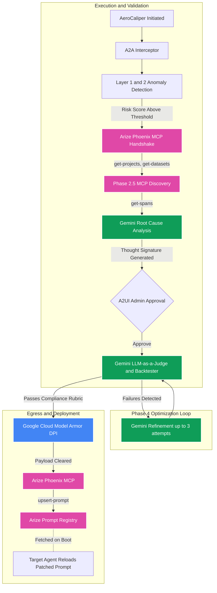

# Agent Architecture

Version: v4.0 -- Last audited: 2026-05-24

---

## Pipeline Diagram

---

## 1. A2A Interceptor

All Gemini operations are routed through `A2AInterceptor` (`a2a_interceptor.py`). Before any inference call executes, the interceptor validates the agent's scoped identity against allowed operations (`remediate:read`, `remediate:write`, `mcp:connect`). Calls that do not match the declared scope are rejected and logged to the audit trail before the Gemini API is contacted.

---

## 2. Anomaly Detection

`anomaly_detector.py` implements a two-layer scan:

- **Layer 1:** Deterministic regex pattern matching against predefined sequences. Examples: `salary`, `pii`, `batch training job`, `gb200`.
- **Layer 2:** A Gemini inference call that returns a `risk_score` (0.0 to 1.0) and a threat classification string.

The active `target_use_case` (`finops` or `hr`) is set at initialization and determines which patterns Layer 1 checks and which domain context Layer 2 receives. This value propagates through all subsequent phases.

---

## 3. MCP Integration (Phases 2 and 2.5)

The system connects to `@arizeai/phoenix-mcp` using the official `modelcontextprotocol.io` Python SDK (`mcp.ClientSession`, `StdioServerParameters`).

- **Phase 2:** Spawns the MCP server process. On Windows: `command="cmd.exe"`, `args=["/c", "npx", "-y", "@arizeai/phoenix-mcp", ...]`. On Unix: `command="npx"`. The `--baseUrl` is constructed from `ARIZE_SPACE_ID`.
- **Phase 2.5:** Executes `get-projects` to confirm the `aerocaliper` project is active, and `get-datasets` to locate the golden dataset for backtesting.
- **Phase 3:** Executes `get-spans` to retrieve the most recent failed trace. If the response is empty, a native GraphQL query is sent directly to the Phoenix API (`/graphql`) targeting the `aerocaliper` project. If both calls return no usable data, the pipeline raises `RuntimeError`.

---

## 4. Thought Signatures

When Gemini produces a candidate patch in Phase 3, the patch text is hashed and wrapped in a Thought Signature token (`sig_v4_<6-char hex hash>`). This token serves as a state-tracking identifier: the pipeline verifies that the text submitted to the admin approval gate, evaluated by the LLM-as-a-Judge, and ultimately deployed via `upsert-prompt` is the same text generated in Phase 3.

---

## 5. Phase 4 Backtesting and Optimization Loop

The backtesting loop runs up to 3 attempts:

1. `golden_dataset.csv` is filtered to the active domain. FinOps runs evaluate only non-HR rows; HR runs evaluate only HR-tagged rows. Pass rate is computed over the filtered set only.
2. Each case is sent to Gemini with the candidate prompt as the system instruction. The response is parsed as JSON and scored by `evaluate_finops_compliance()` or `evaluate_hr_compliance()`.
3. A 100% pass rate on the first attempt exits the loop immediately.
4. If any cases fail and attempts remain, the failure context (user prompt, expected behavior, actual output) is appended to a refinement prompt and submitted to Gemini. The resulting refined candidate replaces the current one and the loop repeats.
5. After 3 failed attempts, the pipeline fails closed.

---

## 6. A2UI Admin Approval Gate

After Phase 4 streams the candidate prompt to the admin dashboard, the pipeline calls `asyncio.Event().wait()` with a 5-minute timeout. The admin submits a `POST /remediate/approve/{session_id}` or `POST /remediate/reject/{session_id}` request via the SSE frontend. A rejection raises an exception and terminates the pipeline without deploying any changes. Timeout also terminates without deployment.

---

## 7. LLM-as-a-Judge Evaluation

After admin approval, a separate Gemini session initialized with a domain-specific compliance rubric evaluates the approved candidate prompt. The rubric uses the Vertex AI Search extractive answer retrieved in Phase 3 as the ground truth policy clause. The judge returns a binary `YES` or `NO` verdict. A `NO` verdict raises an exception and halts deployment.

---

## 8. Model Armor Egress

Before deployment, the patched prompt is submitted to Google Cloud Model Armor via `SanitizeUserPrompt` using the `google-cloud-modelarmor` SDK targeting `modelarmor.us-central1.rep.googleapis.com`. The `AgentGatewaySimulator` (`agent_gateway.py`) raises `RuntimeError` on initialization if the SDK, GCP project ID, or template ID are absent. There is no local regex fallback.

If the `GATEWAY_URL` environment variable is set, the payload is additionally routed to an external HTTP-triggered Cloud Function before the MCP upsert.

---

## Known Limitations

See [Architecture and Limitations](../ARCHITECTURE_AND_LIMITATIONS.md) for the complete list of known limitations, engineering trade-offs, and production hardening requirements.
