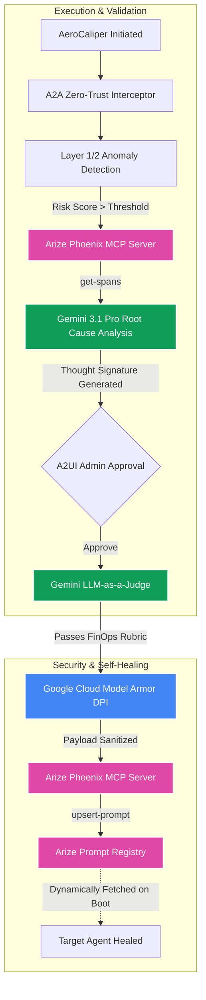

# AeroCaliper Autonomous Agent Architecture

AeroCaliper breaks away from traditional sequential agent loops. We have engineered a deterministic, zero-trust pipeline that treats "Model Context Protocol (MCP) as a Database" and utilizes LLMs solely for diagnostic and reasoning layers.

## End-to-End Pipeline Architecture

## 1. The A2A Zero-Trust Interceptor

Unlike monolithic agent frameworks where the LLM is given direct access to infrastructure APIs, AeroCaliper forces all operations through the `A2AInterceptor`.

Before any Gemini call is executed, the interceptor validates the agent's internal scoped identity (`remediate:write`, `mcp:connect`). If the intent violates the scope, the runtime throws a strict rejection. This limits blast radius.

## 2. Intent-Driven Anomaly Hunting

Instead of blindly polling observability APIs, we layer our agent with a pre-flight anomaly scanner:
1. **Layer 1:** Sub-millisecond deterministic regex. Finds low-hanging fruit (e.g., direct SQL injection attempts).
2. **Layer 2:** LLM Semantic Intent Analysis. Uses Gemini to calculate a `risk_score` (0.0 to 1.0) and categorize the threat before we even engage the complex MCP handshake.

## 3. MCP as a Semantic Graph

Instead of treating the Arize Phoenix MCP server as a simple API proxy, we treat it as an active knowledge graph.
- Our custom, purely async Python MCP client (using the official `modelcontextprotocol.io` SDK) queries `get-spans` to fetch failed execution traces.
- The trace acts as the deterministic anchor for the LLM's diagnostic reasoning.

## 4. Thought Signatures

When Gemini 3.1 Pro determines the root cause of the hallucination (e.g., "The target agent missed the `budget_tag` requirement"), it generates a candidate patch for the system prompt.
We wrap this proposed patch in a cryptographic-style token called a **Thought Signature** (`sig_v3_X`). 
This guarantees state immutability. As the pipeline progresses into the Admin Approval Gate and LLM-as-a-Judge validation phase, we can verify that the exact prompt text generated in Phase 3 is the exact text deployed in Phase 5.

## 5. LLM-as-a-Judge Validation

We do not trust the diagnostic agent to self-deploy. A separate Gemini session is initialized with a strict FinOps compliance rubric. It acts as an LLM-as-a-Judge, running a boolean (`YES`/`NO`) check on the Thought Signature. Only after this machine-validation (and optional human A2UI validation) passes do we execute the `upsert-prompt` MCP tool to fix the target agent.

## 6. Enterprise Egress Security (Google Cloud Model Armor)

Before the final patch is allowed to leave the network boundary and hit the Arize Prompt Registry, it passes through the **Agent Gateway**. This gateway integrates the official `google-cloud-modelarmor` SDK to execute deep packet inspection (DPI) on the payload. It sanitizes the agent's output against enterprise security templates, ensuring that the self-improving prompt does not contain injected malware, PII, or policy violations.
