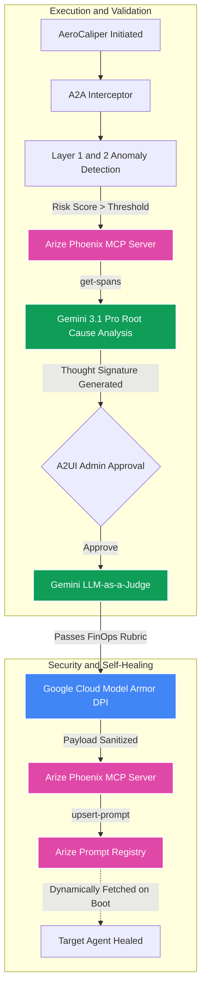

# System Architecture

The system implements a deterministic pipeline utilizing the Model Context Protocol (MCP) and large language models for diagnostic routing.

## End-to-End Pipeline Architecture

## 1. The A2A Interceptor

The architecture routes operations through the `A2AInterceptor`.

Before any Gemini call is executed, the interceptor validates the agent's internal scoped identity (`remediate:write`, `mcp:connect`). If the intent violates the scope, the runtime rejects the request.

## 2. Intent-Driven Anomaly Detection

The system utilizes a two-layer anomaly scanner:
1. **Layer 1:** Deterministic regex pattern matching for predefined string sequences.
2. **Layer 2:** LLM Intent Analysis. Uses Gemini to calculate a `risk_score` (0.0 to 1.0) and categorize the threat prior to the MCP handshake.

## 3. MCP Integration

The system utilizes the Arize Phoenix MCP server for data retrieval.
- The Python MCP client utilizes the official `modelcontextprotocol.io` SDK to query `get-spans` and fetch failed execution traces.
- The trace acts as the deterministic context for the LLM's diagnostic reasoning.

## 4. Thought Signatures

When Gemini 3.1 Pro determines the root cause of the execution failure (e.g., "The target agent missed the `budget_tag` requirement"), it generates a candidate patch for the system prompt.
This proposed patch is wrapped in a unique identifier token called a **Thought Signature** (`sig_v3_X`). 
This mechanism ensures state tracking. As the pipeline progresses into the Admin Approval Gate and LLM-as-a-Judge validation phase, the system verifies that the prompt text generated in Phase 3 matches the text deployed in Phase 5.

## 5. LLM-as-a-Judge Validation

A separate Gemini session is initialized with a FinOps compliance rubric. It acts as an LLM-as-a-Judge, running a boolean (`YES` or `NO`) check on the Thought Signature. Following this machine-validation and the A2UI validation, the `upsert-prompt` MCP tool executes to update the target agent.

## 6. Egress Security (Google Cloud Model Armor)

Before the final patch updates the Arize Prompt Registry, it passes through the **Agent Gateway**. This gateway integrates the official `google-cloud-modelarmor` SDK to execute deep packet inspection (DPI) on the payload. It sanitizes the agent's output against enterprise security templates to prevent policy violations.
