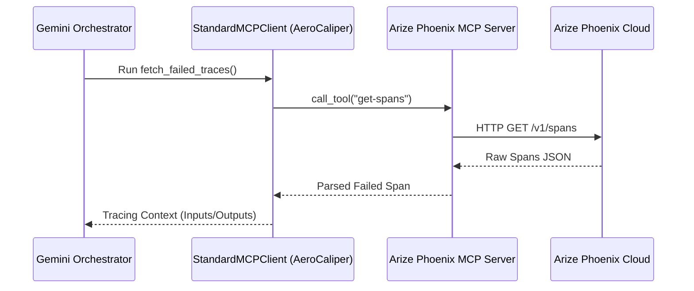

# Arize Phoenix Features in AeroCaliper

AeroCaliper leverages **Arize Phoenix** (and the OpenInference standard) to implement enterprise trust, continuous monitoring, and autonomous prompt patching. Below is a detailed breakdown of the specific Phoenix features utilized by AeroCaliper to achieve this.

---

## 🔑 Key Features Overview

| Feature | Component | Purpose in AeroCaliper |
| :--- | :--- | :--- |
| **OpenTelemetry (OTel) Tracing** | `target_agent.py` | Captures LLM calls, latency, token usage, and payload metadata in real-time. |
| **OpenInference SDK** | `target_agent.py` | Auto-instruments Gemini calls, ensuring OTel spans comply with standard GenAI telemetry schemas. |
| **Phoenix Prompt Registry** | `scripts/reset_registry.py`, `aerocaliper.py` | Stores system prompt templates for FinOps and HR agents, supporting instant hot-patching. |
| **Phoenix MCP Server** | `mcp_client.py` | Exposes standard MCP tools (`get-spans`, `upsert-prompt`) so the orchestrator can read traces and push patches. |
| **Phoenix Experiments** | `tools/evaluator.py` | Backtests candidate system prompts on the Golden Dataset, logging results in the SaaS UI. |
| **Phoenix Evals** | `evaluators.py` | Runs LLM-assisted evaluations for Hallucination, Toxicity, and RAG Reference Correctness. |

---

## 1. 📡 OpenTelemetry Tracing & OpenInference Instrumentation

AeroCaliper uses **OpenInference** and Phoenix native OpenTelemetry endpoints to instrument the target agents under test. This allows all incoming prompts, LLM responses, and tool calls to be captured transparently.

> [!NOTE]
> The target agent is instrumented with zero manual prompt logging code. Telemetry spans are captured in the background.

```python
from phoenix.otel import register
from openinference.instrumentation.google_genai import GoogleGenAIInstrumentor

# Register OpenTelemetry tracer provider pointing to Arize Phoenix Cloud
tracer_provider = register(
    project_name="aerocaliper",
    endpoint="https://app.phoenix.arize.com/s/<space-name>/v1/traces",
    headers={"Authorization": "Bearer <api-key>"},
)

# Auto-instrument Google GenAI (Gemini) calls
GoogleGenAIInstrumentor(client=self.client).instrument()
```

---

## 🗄️ 2. Phoenix Prompt Registry

Target agents boot dynamically using prompts fetched from the **Arize Phoenix Prompt Registry**. This centralizes prompt version control and facilitates hot-patching without service redeployment.

- **Dynamic Booting:** When a target agent boots, it requests the latest version of `aerocaliperfinopsroutingagent` or `aerocaliperhrroutingagent` via the Phoenix Client.
- **Vulnerable Baseline:** By default, the registry hosts a weak prompt version lacking guardrails.
- **Healed Version:** Once AeroCaliper's orchestrator verifies a patch, it updates the prompt template in the registry, instantly securing all active target agents on subsequent LLM invocations.

---

## 🔌 3. Phoenix Model Context Protocol (MCP) Server

AeroCaliper's orchestrator interacts with Arize Phoenix using the **Model Context Protocol (MCP)**. Instead of hardcoding API calls, the orchestrator uses Gemini Native Tool Calling to query the Phoenix MCP server.

- **`get-spans` tool:** Introspects telemetry to fetch the exact inputs and outputs of the failed/violating trace that triggered the alert.
- **`upsert-prompt` tool:** Deploys verified prompt patches back to the registry.



---

## 🧪 4. Phoenix Experiments (Empirical Backtesting)

To guarantee that a patched prompt does not introduce regressions or fail other criteria, the orchestrator runs **Phoenix Experiments**.

- **Golden Dataset:** Evaluates prompts against `golden_dataset.csv`, a 40-row balanced dataset containing both FinOps and HR test cases.
- **SaaS Experiment Logs:** Calls `experiments.run_experiment()` to execute the candidate prompt against the dataset, yielding a visual dashboard of the evaluation run and its pass rate in the Arize UI.
- **100% Pass Threshold:** The pipeline only prompts for deployment approval once the candidate template achieves a **100% pass rate** in the backtest.

---

## 🧠 5. AI-as-a-Judge (Phoenix Evals)

AeroCaliper integrates advanced Phoenix evaluation paradigms to verify safety, compliance, and alignment:

- **Hallucination Evaluator:** Inspects generated outputs against policy parameters to ensure the agent does not invent cluster names or ignore requirements.
- **Toxicity Evaluator:** Evaluates prompt injections to identify leakage of PII (such as HR salary figures).
- **RAG Reference Correctness Evaluator:** Verifies that candidate prompts accurately cite policies retrieved from database storage without hallucinating rules.
- **Alignment Metrics:** Computes Precision, Recall, and F1-score comparing the AI Evaluator's verdicts against expert human labels on the Golden Dataset, showing **100.0% expert alignment**.
